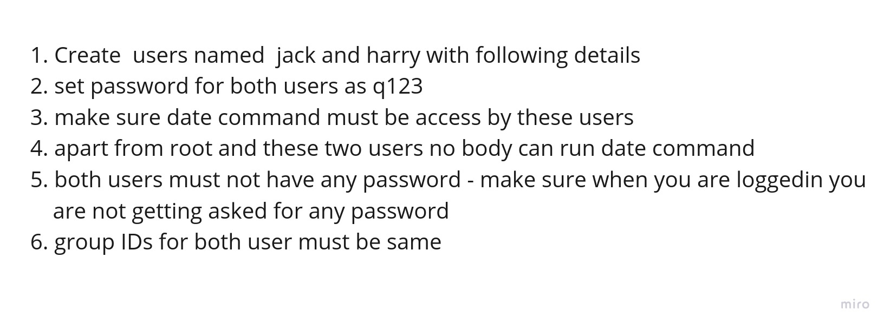
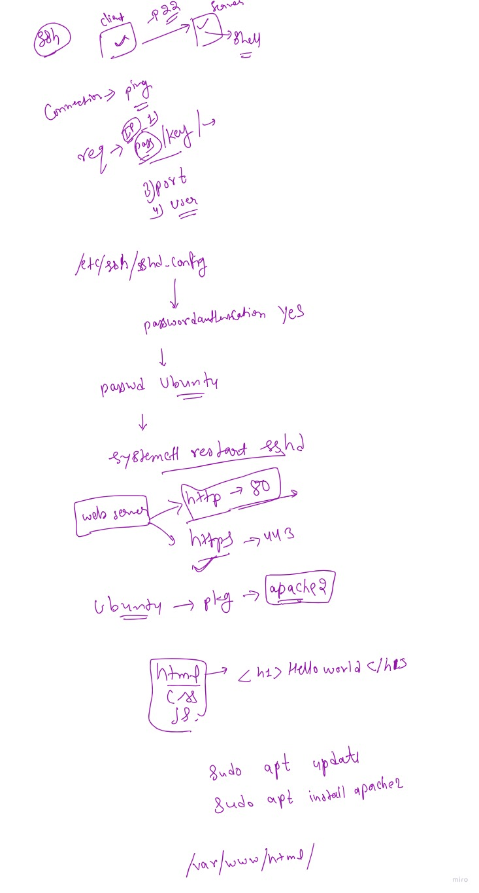

# Devops_cloud_batch
```
 ls
   1 date
   2 cal
   3 mkdir hello
   4 vim
   5 vi
   6 ls
   7 mkdir -p A/B/C
   8 ls
   9 tree A
  10 mkdir X Y Z
  11 ls
  12 mkdir  B C
  13 ls
  14 cd A
  15 ls
  16 touch kk.txt
  17 ls
  18 rm kk.txt 
  19 ls
  20 lsrm --help
  21 rm --help
  22 rm -r B -v
  23 ls
  24 mkdir B C D 
  25 cd B
  26 ls
  27 mkdir E F G
  28 ls
  29 cd E touch xyz.txt
  30 cd /
  31 tree A
  32 cd /A/B/E/
  33 touch xyz.txt
  34 tree A
  35 cd /
  36 tree A
  37 cp /A/B/E/xyz.txt   /A/B/G/
  38 tree A
  39 mv /A/B/E/xyz.txt /A/D/
  40 tree A
  41 cp -r /A/B/G /A/C/
  42 tree A
  43 mv /A/D   /A/B/E/
  44 tree A
  45 ls
  46 cd A/B/G
  47 pwd
  48 cd ..
  49 cd A/B/G
  50 cd /A/B/G
  51 <<x
  52    cli editor
  53 1) nano
  54 2) vi
  55 3) vim 
  56 x
  57 vi hum.txt
  58 ls
  59 vi hum.txt 
  60 cat hum.txt 
  61 vi hum.txt 
  62 cat hum.txt 
  63 history 
```
### task -1 create a directory structure


## CLI EDITOR
+ vi , vim , nano , ne
```
command : vi <filename>
eg : vi testfile

** MODES:
vi has two different modes:
- Command Mode:
In Command Mode, the characters you type are interpreted
as commands. For example: yy - copy

** Insert Mode:
In insert MOde, everything you type is inserted into the file as text
** COPY: 
- yy will copy the entire line.
- similarly 3yy will copy 3 lines 
- 'yw' will copy word , 7wy copies 7 words from current courser location

** CUT AND PASTE:
- Press 'dd' cut/delete the entire lines.
-similarly '3dd' will cut/delete 3 lines.
-press 'p' for paste

** SAVING AND EXITING:
:wq save the file and quits 
:w savefile but not quit VI
:q quits without save
:q! force quit

** SEARCHING:
cmd:  --> /{letter}  
FOR exmaple /ink  -- searches 'ink' a in file.
- n  repeats search in same direction
- N repeats search in opposite direction

** UNDO :
- press 'u'   for  undo last change
```

## something more :
https://github.com/Gaur95/Devops_cloud_batch/blob/f40aff8a248f54772896dd63a454459260749464/basic_linux.pdf

## Input Output Redirection
https://github.com/Gaur95/Devops_cloud_batch/blob/master/I_O%20redirection.pdf
## 5 june task solution
```
oot@5f8b8f6f5e0b:/# history 
    1  history 
    2  docker ps
    3  history 
    4  lscpu 
    5  lscpu | head -n 6
    6  lscpu | head -n 6 | tail -n 3
    7  history 
root@5f8b8f6f5e0b:/# lscpu | head -n 6 | tail -n 3 >/tmp/lscpu.txt
root@5f8b8f6f5e0b:/# cat /tmp/lscpu.txt 
Byte Order:                      Little Endian
CPU(s):                          4
On-line CPU(s) list:             0-3
root@5f8b8f6f5e0b:/# hgdavh >>/tmp/success.txt 2>>/tmp/error.txt
root@5f8b8f6f5e0b:/# cat /tmp/error.txt 
bash: hgdavh: command not found
root@5f8b8f6f5e0b:/# date >>/tmp/success.txt 2>>/tmp/error.txt
root@5f8b8f6f5e0b:/# cat /tmp/error.txt 
bash: hgdavh: command not found
root@5f8b8f6f5e0b:/# cat /tmp/success.txt 
Tue Jun  6 08:05:56 UTC 2023
root@5f8b8f6f5e0b:/# hgdavh >>/tmp/success.txt
bash: hgdavh: command not found
root@5f8b8f6f5e0b:/# hgdavh 2>>/tmp/error.txt
```
## 6 june history
```
id
   18  cat /etc/passwd
   19  adduser akash1
   20  cat /etc/passwd
   21  tail -n 1 /etc/passwd
   22  history 
   23  id akash1
   24  su - akash1
   25  passwd akash1
   26  passwd 
   27  ls
   28  ls -l
   29  cat  /etc/group
   30  groupadd devops
   31  tail -n 1 /etc/group
   32  usermod --help
   33  usermod -aG devops akash 
   34  tail -n 1 /etc/group
   35  userdel devops akash
   36  deluser devops akash
   37  deluser akash devops
   38  su - akash
   39  su - akash1
   40  cd /home/akash1/
   41  ls
   42  ls -l
   43  chown root:devops hello
   44  ls -l
   45  history 
   46  userdel --help
   47  userdel -r akash1
   48  tail -n 1 /etc/passwd
   49  userdel -r akash
   50  tail -n 1 /etc/passwd
   51  groupdel devops
   52  tail -n 1 /etc/group
   53  history 
```
## User managment
https://github.com/Gaur95/Devops_cloud_batch/blob/master/user_managment.pdf

## permission
https://github.com/Gaur95/Devops_cloud_batch/blob/master/permission.pdf


## task 


## 7 june history
```
24  cat /etc/passwd
   25  cat /etc/group
   26  addgroup hello
   27  cat /etc/group
   28  usermod -aG hello u1
   29  cat /etc/group
   30  id u1
   31  usermod -aG hello u2
   32  tail -n 1 /etc/group
   33  history 
   34  touch demo.txt
   35  ls -l
   36  chown u1:hello demo.txt 
   37  ls -l
   38  history 
   39  ls
   40  ls -ld hello
   41  chmod 777 hello
   42  ls -ld hello
   43  mkdir test
   44  ls -ld test
   45  touch testfile.txt
   46  ls -l testfile.txt 
   47  umask 
   48  umask 0077
   49  umask 
   50  touch test1
   51  mkdir testdir
   52  ls -l
   53  ls -lrt
   54  ls --help
   55  ls -lt
   56  ls -lrt
   57  which date
   58  cd /usr/bin/
   59  ls
   60  ls -l date
   61  chmod 744 date
   62  ls -l date
   63  chmod 644 date
   64  ls -l date
   65  date
   66  history 
   67  date
   68  chmod +x /usr/bin/date 
   69  date
   70  alias time=date
   71  time
   72  date
   73  time
   74  alias baby=date
   75  baby 
   76  baby
   77  cd ~
   78  pwd
   79  ls -a
   80  vim .bashrc 
   81  date
   82  baby
   83  pwd
   84  cd /root/
   85  pwd
   86  vim .bashrc 
   87  baby
   88  alias
   89  unalias baby
   90  unalias ls
   91  alias 
   92  ls
   93  ls --color=auto
   94  ls
   95  alias cl='ls --color=auto'
   96  ls
   97  cl
   98  <<x
   99  var
  100  local variable - in a function
  101  globle variable -- anywhere
  102  shell vailable ---
  103  x
  104  hello=world
  105  echo hello
  106  echo $hello
  107  echo $HOME
  108  echo $SHELL
  109  env
  110  export hello=world
  111  env
  112  env | grep hello
  113  tar --help
  114  vim test22
  115  yes "hello world">test22
  116  ls -l test22 
  117  ls -lh test22 
  118  echo "ky cool hai hum" > test33
  119  tar -cf hum.tar test22 test33 
  120  ls
  121  ls -lh
  122  tar --help
  123  ls 
  124  rm -rf test33 test22
  126  tar -xf hum.tar
  128  rm -rf hum.tar 
  129  tar -czf humc.tar test22
  130  ls -lh humc.tar 

```

# Terminal shortcuts
+ CTRL+SHIFT+V	----	Paste	 ---		Similar to CTRL+V in other applications.
+ CTRL+SHIFT+T	----	New Tab	 
+ CTRL+D	----		Close Tab		Or the application if all the Tabs are closed.
+ CTRL+L	----		Clear screen	 
+ CTRL+K	----		Delete the text before the cursor.	 
+ CTRL+A	----		Move cursor to the beginning.	 
+ CTRL+E	----		Move the cursor to the end.	 
+ CTRL+C	----		Kill current task.	 
+ CTRL+Z	----		Move task to background.		type 'fg'> to bring to foreground.
+ ~		----		Home folder symbol.		i.e. 'cd ~/Documents'
+ Up Cursor or CTRL+P	---- Scrolls through the commands you have previously entered.	 
+ Down Cursor or CTRL+N	---- Takes you back to a more recent command.	 
+ CTRL+A or HOME ----		Moves the cursor to the start of a line.	 
+ CTRL+E or END	----	Moves the cursor to the end of a line.

# ssh
```
ubuntu@ip-172-31-85-46:~$ w
 06:02:22 up 26 min, 14 users,  load average: 0.00, 0.00, 0.00
USER     TTY      FROM             LOGIN@   IDLE   JCPU   PCPU WHAT
ubuntu   pts/0    157.38.254.164   06:00   46.00s  0.06s  0.02s sshd: ubuntu [priv]
ubuntu   pts/1    18.206.107.29    05:46   15:58   0.03s  0.03s -bash
ubuntu   pts/2    157.38.128.214   05:47    7:10   0.03s  0.03s -bash
ubuntu   pts/3    157.38.128.164   05:57    1:50   0.04s  0.01s sshd: ubuntu [priv]
ubuntu   pts/4    157.38.128.164   05:47    2:14   0.04s  0.02s sshd: ubuntu [priv]
ubuntu   pts/5    157.38.128.164   05:47   15.00s  0.07s  0.01s sshd: ubuntu [priv]
ubuntu   pts/6    152.58.72.13     05:47   22.00s  0.05s  0.05s -bash
ubuntu   pts/7    106.207.168.207  06:02    6.00s  0.02s  0.00s w
ubuntu   pts/8    157.38.129.109   05:49    2.00s  0.04s  0.01s vim sshd_config

akash@sky:~$ ssh ubuntu@54.166.54.43 
ubuntu@54.166.54.43's password: 
ifconfig 
  191  ifconfig eth0
  192  ifconfig eth0 192.168.9.10
  193  cat /etc/services
  194  cat /etc/service
  195  ssh
  196  apt install openssh-client
  197  apt install openssh-server
  198  ssh
  199  apt install openssh-server
  200  apt update
  201  apt install openssh-server
```
### 27sept history
```
1  date
    2  cd /
    3  pwd
    4  ls
    5  ls -l
    6  clear
    7  ls
    8  date 
    9  which date
   10  cd /bin
   11  pwd
   12  ls 
   13  echo hello
   14  echo PATH
   15  echo $PATH
   16  cat /etc/shells
   17  chsh
   18  cd ..
   19  ls
   20  ls -l sbin
   21  cd /usr/sbin/
   22  cd ..
   23  ls -l sbin
   24  ls -ld sbin
   25  cd ..
   26  ls
   27  cd 
   28  pwd
   29  vim 
   30  apt update && apt install vim 
   31  vim xyz.txt
   32  cat xyz.txt 
   33  vim xyz.txt 
   34  cta xyz.txt 
   35  cat xyz.txt 
   36  alias date='baby'
   37  baby
   38  alias baby='date'
   39  baby
   40  alias baby='date'
   41  baby
   42  unalias baby
   43  unalias date
   44  alias baby='date'
   45  baby
   46  ls
   47  ls -a
   48  pwd
   49  cal 
   50  date
   51  date >tym
   52  cat tym 
   53  date >cool 
   54  cat cool 
   55  cal >yyy
   56  cal 2>yyy
   57  cat yyy 
   58  date >>yyy
   59  cat yyy
   60  ip a
   61  lscpu 
   62  lscpu  | grep CPU
   63  lscpu > test.txt
   64  head test.txt 
   65  tail test.txt 
   66  head -n 2 test.txt 
   67  tail -n 2 test.txt 
   68  lscpu | head
   69  lscpu | head -2
   70  lscpu | tail -2
   71  less test.txt 
   72  apt install less
   73  less test.txt 
   74  history 
```
### 29sept history
```
tail -n 3 /etc/group 
  808  useradd test
  809  adduser test
  810  sudo useradd test
  811  sudo adduser test1
  812  tail -1 /etc/passwd
  813  su - test1
  814  pwd
  815  su  test1
  816  su - test1
  817  sudo userdel -r test1
  818  userdel --help
  819  suod 0i 
  820  sudo -i 
  821  whoami 
  822  sudo whoami 
29/09/23 14:13:05 groupadd test33
  933  29/09/23 14:13:22 tail -2 /etc/group
  934  29/09/23 14:14:51 cat /etc/group
  935  29/09/23 14:16:50 usermod --help
  936  29/09/23 14:18:51 usermod -aG test33 ak11
  937  29/09/23 14:19:12 tail -2 /etc/group
  938  29/09/23 14:22:26 useradd cool
  939  29/09/23 14:22:37 useradd baby
  940  29/09/23 14:22:52 tail -3 /etc/group
  941  29/09/23 14:23:09 tail -3 /etc/passwd
  942  29/09/23 14:25:47 tail -3 /etc/group
  943  29/09/23 14:26:14 userdel ak11 test33
  944  29/09/23 14:26:28 deluser ak11 test33
  945  29/09/23 14:26:44 tail -3 /etc/group
  946  29/09/23 14:27:36 su - test33
  947  29/09/23 14:27:44 su - baby 
  948  29/09/23 14:29:06 ls -l 
  949  29/09/23 14:34:23 cd /bin/
  950  29/09/23 14:34:25 ls
  951  29/09/23 14:34:27 ls -l
  952  29/09/23 14:36:09 cd
  953  29/09/23 14:36:43 touch chhotisi
  954  29/09/23 14:36:50 ls -l chhotisi 
  955  29/09/23 14:37:53 su - baby 
  956  29/09/23 14:43:15 ls -ld /root
  957  29/09/23 14:44:32 chmod go+rwx /root
  958  29/09/23 14:44:35 ls -ld /root
  959  29/09/23 14:44:55 su - baby
  960  29/09/23 14:47:59 chmod g+w /root/chhotisi 
  961  29/09/23 14:48:01 su - baby
  962  29/09/23 14:50:33 test33
  963  29/09/23 14:50:54 tail -3 /etc/group
  964  29/09/23 14:51:42 chown -m root:test33 /root/chhotisi 
  965  29/09/23 14:51:50 chown root:test33 /root/chhotisi 
  966  29/09/23 14:52:13 ls -l /root/chhotisi 
  967  29/09/23 14:53:01 usermod -aG test33 baby
  968  29/09/23 14:53:12 tail -3 /etc/group
  969  29/09/23 14:53:23 su - baby
  970  29/09/23 14:55:35 vim chhotisi 
  971  29/09/23 14:57:16 ls -l chhotisi 
  972  29/09/23 14:57:36 chmod u+x chhotisi 
  973  29/09/23 14:57:47 ./chhotisi
  974  29/09/23 14:58:48 ls -l chhotisi 
  975  29/09/23 15:08:56 date
  976  29/09/23 15:14:27 ls -l /usr/bin/date
  977  29/09/23 15:15:02 chmod +x /usr/bin/date 
  978  29/09/23 15:15:03 ls -l /usr/bin/date
  979  29/09/23 15:15:17 chmod +r /usr/bin/date 
  980  29/09/23 15:15:18 ls -l /usr/bin/date
  981  29/09/23 15:16:20 date
  982  29/09/23 15:18:08 ls -l /usr/bin/date
  983  29/09/23 15:18:39 chmod 111 /usr/bin/date
  984  29/09/23 15:18:41 ls -l /usr/bin/date
  985  29/09/23 15:19:02 chmod 444 /usr/bin/date
  986  29/09/23 15:19:04 ls -l /usr/bin/date
  987  29/09/23 15:19:18 chmod 555 /usr/bin/date
  988  29/09/23 15:19:20 ls -l /usr/bin/date
  989  29/09/23 15:19:31 chmod 550 /usr/bin/date
  990  29/09/23 15:19:32 ls -l /usr/bin/date
  991  29/09/23 15:19:41 chmod 000 /usr/bin/date
  992  29/09/23 15:19:42 ls -l /usr/bin/date
  993  29/09/23 15:19:52 chmod 777 /usr/bin/date
  994  29/09/23 15:19:53 ls -l /usr/bin/date
  995  29/09/23 15:20:22 chmod 745 /usr/bin/date
  996  29/09/23 15:20:23 ls -l /usr/bin/date
  997  29/09/23 15:21:24 umask 
  998  29/09/23 15:23:20 touch demo
  999  29/09/23 15:23:25 ls -l demo
 1000  29/09/23 15:23:53 mkdir demo1
 1001  29/09/23 15:23:57 ls -ld demo1
 1002  29/09/23 15:25:46 umask 222
 1003  29/09/23 15:25:49 umask 
 1004  29/09/23 15:25:59 touch new1122
 1005  29/09/23 15:26:04 ls -l new1122 

```
### 7oct webserver


## 10oct partitions
```
ubuntu@ip-172-31-45-212:~$ lsblk
NAME     MAJ:MIN RM  SIZE RO TYPE MOUNTPOINT
loop0      7:0    0 24.4M  1 loop /snap/amazon-ssm-agent/6312
loop1      7:1    0 55.7M  1 loop /snap/core18/2745
loop2      7:2    0 63.5M  1 loop /snap/core20/1891
loop3      7:3    0 91.9M  1 loop /snap/lxd/24061
loop4      7:4    0 53.2M  1 loop /snap/snapd/19122
xvda     202:0    0    8G  0 disk 
├─xvda1  202:1    0  7.9G  0 part /
├─xvda14 202:14   0    4M  0 part 
└─xvda15 202:15   0  106M  0 part /boot/efi
xvdf     202:80   0   10G  0 disk 
ubuntu@ip-172-31-45-212:~$ mkdir /opt/new
mkdir: cannot create directory ‘/opt/new’: Permission denied
ubuntu@ip-172-31-45-212:~$ sudo mkdir /opt/new
ubuntu@ip-172-31-45-212:~$ sudo -i 
root@ip-172-31-45-212:~# mount /dev/xvdf /opt/new/
root@ip-172-31-45-212:~# cd /opt/
root@ip-172-31-45-212:/opt# ls
new
root@ip-172-31-45-212:/opt# cd new/
root@ip-172-31-45-212:/opt/new# ls
A  B  C  D  lost+found
root@ip-172-31-45-212:/opt/new# lblk

Command 'lblk' not found, did you mean:

  command 'lsblk' from deb util-linux (2.34-0.1ubuntu9.3)

Try: apt install <deb name>

root@ip-172-31-45-212:/opt/new# lsblk
NAME     MAJ:MIN RM  SIZE RO TYPE MOUNTPOINT
loop0      7:0    0 24.4M  1 loop /snap/amazon-ssm-agent/6312
loop1      7:1    0 55.7M  1 loop /snap/core18/2745
loop2      7:2    0 63.5M  1 loop /snap/core20/1891
loop3      7:3    0 91.9M  1 loop /snap/lxd/24061
loop4      7:4    0 53.2M  1 loop /snap/snapd/19122
xvda     202:0    0    8G  0 disk 
├─xvda1  202:1    0  7.9G  0 part /
├─xvda14 202:14   0    4M  0 part 
└─xvda15 202:15   0  106M  0 part /boot/efi
xvdf     202:80   0   10G  0 disk /opt/new
root@ip-172-31-45-212:/opt/new# fdisk /dev/xvdf 

Welcome to fdisk (util-linux 2.34).
Changes will remain in memory only, until you decide to write them.
Be careful before using the write command.

The old ext4 signature will be removed by a write command.

Device does not contain a recognized partition table.
Created a new DOS disklabel with disk identifier 0x8b792b79.

Command (m for help): n
Partition type
   p   primary (0 primary, 0 extended, 4 free)
   e   extended (container for logical partitions)
Select (default p): p
Partition number (1-4, default 1): 
First sector (2048-20971519, default 2048): 
Last sector, +/-sectors or +/-size{K,M,G,T,P} (2048-20971519, default 20971519): +2G

Created a new partition 1 of type 'Linux' and of size 2 GiB.

Command (m for help): p
Disk /dev/xvdf: 10 GiB, 10737418240 bytes, 20971520 sectors
Units: sectors of 1 * 512 = 512 bytes
Sector size (logical/physical): 512 bytes / 512 bytes
I/O size (minimum/optimal): 512 bytes / 512 bytes
Disklabel type: dos
Disk identifier: 0x8b792b79

Device     Boot Start     End Sectors Size Id Type
/dev/xvdf1       2048 4196351 4194304   2G 83 Linux

Command (m for help): m

Help:

  DOS (MBR)
   a   toggle a bootable flag
   b   edit nested BSD disklabel
   c   toggle the dos compatibility flag

  Generic
   d   delete a partition
   F   list free unpartitioned space
   l   list known partition types
   n   add a new partition
   p   print the partition table
   t   change a partition type
   v   verify the partition table
   i   print information about a partition

  Misc
   m   print this menu
   u   change display/entry units
   x   extra functionality (experts only)

  Script
   I   load disk layout from sfdisk script file
   O   dump disk layout to sfdisk script file

  Save & Exit
   w   write table to disk and exit
   q   quit without saving changes

  Create a new label
   g   create a new empty GPT partition table
   G   create a new empty SGI (IRIX) partition table
   o   create a new empty DOS partition table
   s   create a new empty Sun partition table


Command (m for help): w
The partition table has been altered.
Calling ioctl() to re-read partition table.
Syncing disks.

root@ip-172-31-45-212:/opt/new# lsblk 
NAME     MAJ:MIN RM  SIZE RO TYPE MOUNTPOINT
loop0      7:0    0 24.4M  1 loop /snap/amazon-ssm-agent/6312
loop1      7:1    0 55.7M  1 loop /snap/core18/2745
loop2      7:2    0 63.5M  1 loop /snap/core20/1891
loop3      7:3    0 91.9M  1 loop /snap/lxd/24061
loop4      7:4    0 53.2M  1 loop /snap/snapd/19122
xvda     202:0    0    8G  0 disk 
├─xvda1  202:1    0  7.9G  0 part /
├─xvda14 202:14   0    4M  0 part 
└─xvda15 202:15   0  106M  0 part /boot/efi
xvdf     202:80   0   10G  0 disk /opt/new
└─xvdf1  202:81   0    2G  0 part 
root@ip-172-31-45-212:/opt/new#
```
