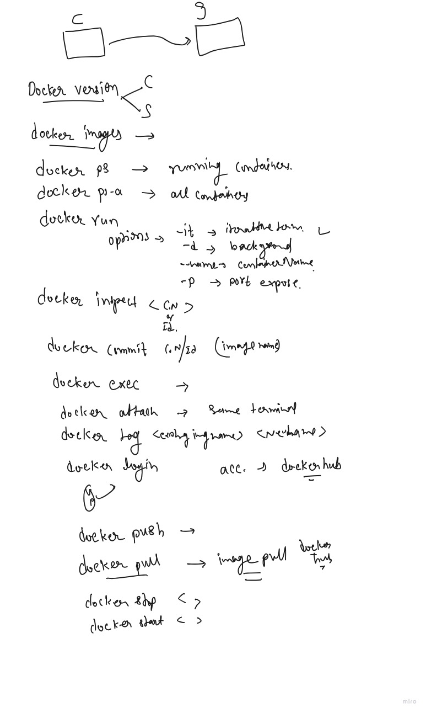

# docker introduction
https://github.com/Gaur95/Devops_cloud_batch/blob/1d864748fcafeba37976958883c16ddf3b9daebd/docker%20ppt.pdf
# docker commands
```
docker version
  821  docker images
  822  docker ps
  823  docker ps -a
  824  docker run ubuntu sleep 30
  825  docker run ubuntu pwd
  826  docker run ubuntu echo hello world
  827  docker run -d ubuntu sleep 60
  828  docker ps
  829  docker run -d ubuntu bash
  830  docker ps
  831  docker run -d  ubuntu sleep 200 
  832  docker ps
  833  docker exec -it clever_lederberg bash
  834  docker ps
  835  docker run -itd ubuntu bash
  836  docker ps
  837  cd /var/lib/
  838  ls
  839   /var/lib/docker/
  840  sudo -i 
  841  cd
  842  docker ps
  843  docker exec -it admiring_bell bash
  844  docker ps
  845  docker inspect 3e
  846  docker exec -it admiring_bell bash
  847  docker commit myapache 3ea
  848  docker commit 3ea myapache
  849  docker images
  850  docker run -itd --name ak -p 1122:80 myapache bash

```


## Portainer
```
docker volume create portainer_data
```
```
docker run -d -p 8000:8000 -p 9443:9443 --name portainer --restart=always -v /var/run/docker.sock:/var/run/docker.sock -v portainer_data:/data portainer/portainer-ce:latest
```
