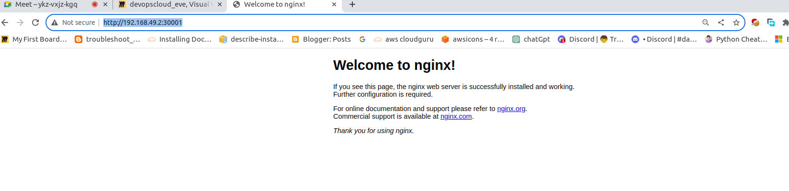

```akash@sky:~/Desktop/Devops_cloud_batch$ kubectl api-resources 
NAME                              SHORTNAMES   APIVERSION                             NAMESPACED   KIND
bindings                                       v1                                     true         Binding
componentstatuses                 cs           v1                                     false        ComponentStatus
configmaps                        cm           v1                                     true         ConfigMap
endpoints                         ep           v1                                     true         Endpoints
events                            ev           v1                                     true         Event
limitranges                       limits       v1                                     true         LimitRange
namespaces                        ns           v1                                     false        Namespace
nodes                             no           v1                                     false        Node
persistentvolumeclaims            pvc          v1                                     true         PersistentVolumeClaim
persistentvolumes                 pv           v1                                     false        PersistentVolume
pods                              po           v1                                     true         Pod
podtemplates                                   v1                                     true         PodTemplate
replicationcontrollers            rc           v1                                     true         ReplicationController
```
```
akash@sky:~/Desktop/Devops_cloud_batch$ kubectl create namespace jecrc
namespace/jecrc created
akash@sky:~/Desktop/Devops_cloud_batch$ kubectl get ns
NAME                   STATUS   AGE
default                Active   156d
ingress-nginx          Active   156d
jecrc                  Active   8s
kube-node-lease        Active   156d
```
```
akash@sky:~/Desktop/Devops_cloud_batch$ kubectl apply -f pod1.yml --namespace jecrc
pod/myapp created
akash@sky:~/Desktop/Devops_cloud_batch$ kubectl get po --namespace jecrc 
NAME    READY   STATUS     RESTARTS   AGE
myapp   0/1     Init:3/5   0          31s
akash@sky:~/Desktop/Devops_cloud_batch$ kubectl get po --namespace jecrc  -w
NAME    READY   STATUS     RESTARTS   AGE
myapp   0/1     Init:3/5   0          68s
myapp   0/1     Init:3/5   0          73s
myapp   0/1     Init:4/5   0          79s
myapp   0/1     Init:4/5   0          102s
myapp   0/1     PodInitializing   0          103s
myapp   1/1     Running           0          107s
^Cakash@sky:~/Desktop/Devops_cloud_batch$ kubectl get po --namespace jecrc  
NAME    READY   STATUS    RESTARTS   AGE
myapp   1/1     Running   0          118s
```
### rc cmd
```
akash@sky:~/Desktop/Devops_cloud_batch$ kubectl apply -f rc.yaml 
replicationcontroller/ak-app created
akash@sky:~/Desktop/Devops_cloud_batch$ kubectl get po
NAME                                           READY   STATUS    RESTARTS     AGE
ak-app-29tjs                                   1/1     Running   0            29s
ak-app-6pqwq                                   1/1     Running   0            29s
ak-app-bskpg                                   1/1     Running   0            29s
ak-app-hkd99                                   1/1     Running   0            29s

akash@sky:~/Desktop/Devops_cloud_batch$ kubectl get rc
NAME     DESIRED   CURRENT   READY   AGE
ak-app   4         4         4       3m33s
```
```
akash@sky:~/Desktop/Devops_cloud_batch$ kubectl apply -f deploy.yml 
deployment.apps/mydeploy created
akash@sky:~/Desktop/Devops_cloud_batch$ kubectl get deploy
NAME                          READY   UP-TO-DATE   AVAILABLE   AGE
akdep1                        1/1     1            1           15d
datadog-agent-cluster-agent   1/1     1            1           15d
mydeploy                      0/2     2            0           15s
akash@sky:~/Desktop/Devops_cloud_batch$ kubectl get po
NAME                                           READY   STATUS              RESTARTS     AGE
ak-app-hkd99                                   1/1     Running             0            20m
ak-app-t4f9s                                   1/1     Running             0            17m
akdep1-76fbb67846-qvjjg                        1/1     Running             0            9d
datadog-agent-cluster-agent-7c498d4668-lpsth   1/1     Running             1 (9d ago)   14d
datadog-agent-gr7lv                            3/3     Running             6 (9d ago)   15d
mydeploy-5c6997464c-7rwzg                      0/1     ContainerCreating   0            31s
mydeploy-5c6997464c-zgmt2                      0/1     ContainerCreating   0            31s
akash@sky:~/Desktop/Devops_cloud_batch$ kubectl get po
NAME                                           READY   STATUS    RESTARTS     AGE
ak-app-hkd99                                   1/1     Running   0            20m
ak-app-t4f9s                                   1/1     Running   0            17m
akdep1-76fbb67846-qvjjg                        1/1     Running   0            9d
datadog-agent-cluster-agent-7c498d4668-lpsth   1/1     Running   1 (9d ago)   14d
datadog-agent-gr7lv                            3/3     Running   6 (9d ago)   15d
mydeploy-5c6997464c-7rwzg                      1/1     Running   0            54s
mydeploy-5c6997464c-zgmt2                      1/1     Running   0            54s
akash@sky:~/Desktop/Devops_cloud_batch$ kubectl apply -f deploy.yml 
deployment.apps/mydeploy configured
akash@sky:~/Desktop/Devops_cloud_batch$ kubectl get po
NAME                                           READY   STATUS              RESTARTS     AGE
ak-app-hkd99                                   1/1     Running             0            29m
ak-app-t4f9s                                   1/1     Running             0            26m
akdep1-76fbb67846-qvjjg                        1/1     Running             0            9d
datadog-agent-cluster-agent-7c498d4668-lpsth   1/1     Running             1 (9d ago)   14d
datadog-agent-gr7lv                            3/3     Running             6 (9d ago)   15d
mydeploy-5c6997464c-7rwzg                      1/1     Running             0            9m39s
mydeploy-5c6997464c-dv5sx                      0/1     ContainerCreating   0            2s
mydeploy-5c6997464c-h7c8r                      0/1     Pending             0            2s
mydeploy-5c6997464c-jjdq2                      0/1     ContainerCreating   0            2s
mydeploy-5c6997464c-mvt7r                      0/1     ContainerCreating   0            2s
mydeploy-5c6997464c-nxwjh                      0/1     ContainerCreating   0            2s
mydeploy-5c6997464c-pl8g4                      0/1     ContainerCreating   0            2s
mydeploy-5c6997464c-qssmr                      0/1     ContainerCreating   0            2s
mydeploy-5c6997464c-zgmt2                      1/1     Running             0            9m39s
mydeploy-5c6997464c-zzdl2                      0/1     Pending             0            2s
akash@sky:~/Desktop/Devops_cloud_batch$ kubectl get po -w
NAME                                           READY   STATUS              RESTARTS     AGE
ak-app-hkd99                                   1/1     Running             0            29m
ak-app-t4f9s                                   1/1     Running             0            26m
akdep1-76fbb67846-qvjjg                        1/1     Running             0            9d
datadog-agent-cluster-agent-7c498d4668-lpsth   1/1     Running             1 (9d ago)   14d
datadog-agent-gr7lv                            3/3     Running             6 (9d ago)   15d
mydeploy-5c6997464c-7rwzg                      1/1     Running             0            9m52s
mydeploy-5c6997464c-dv5sx                      1/1     Running             0            15s
mydeploy-5c6997464c-h7c8r                      0/1     ContainerCreating   0            15s
mydeploy-5c6997464c-jjdq2                      1/1     Running             0            15s
mydeploy-5c6997464c-mvt7r                      0/1     ContainerCreating   0            15s
mydeploy-5c6997464c-nxwjh                      1/1     Running             0            15s
mydeploy-5c6997464c-pl8g4                      1/1     Running             0            15s
mydeploy-5c6997464c-qssmr                      1/1     Running             0            15s
mydeploy-5c6997464c-zgmt2                      1/1     Running             0            9m52s
mydeploy-5c6997464c-zzdl2                      0/1     ContainerCreating   0            15s
mydeploy-5c6997464c-mvt7r                      1/1     Running             0            16s
```
## service Nodeport
```
akash@sky:~/Desktop/Devops_cloud_batch$ kubectl apply -f svc.yaml 
service/mysvc created
akash@sky:~/Desktop/Devops_cloud_batch$ kubectl get svc
NAME                                               TYPE        CLUSTER-IP       EXTERNAL-IP   PORT(S)             AGE

kubernetes                                         ClusterIP   10.96.0.1        <none>        443/TCP             156d
myapp                                              NodePort    10.105.60.11     <none>        1133:30000/TCP      140d
mysvc                                              NodePort    10.110.199.105   <none>        1133:30001/TCP      11s
akash@sky:~/Desktop/Devops_cloud_batch$ minikube ip
192.168.49.2
akash@sky:~/Desktop/Devops_cloud_batch$ ^C
akash@sky:~/Desktop/Devops_cloud_batch$ kubectl get deployments.apps 
NAME                          READY   UP-TO-DATE   AVAILABLE   AGE
akdep1                        1/1     1            1           15d
datadog-agent-cluster-agent   1/1     1            1           15d
mydeploy                      10/10   10           10          26m
```
