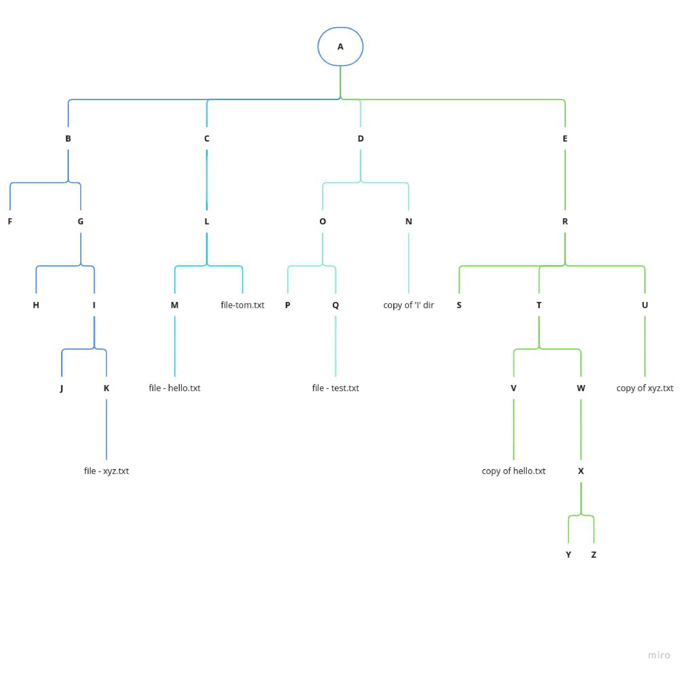

# Devops_cloud_batch
```
 ls
   1 date
   2 cal
   3 mkdir hello
   4 vim
   5 vi
   6 ls
   7 mkdir -p A/B/C
   8 ls
   9 tree A
  10 mkdir X Y Z
  11 ls
  12 mkdir  B C
  13 ls
  14 cd A
  15 ls
  16 touch kk.txt
  17 ls
  18 rm kk.txt 
  19 ls
  20 lsrm --help
  21 rm --help
  22 rm -r B -v
  23 ls
  24 mkdir B C D 
  25 cd B
  26 ls
  27 mkdir E F G
  28 ls
  29 cd E touch xyz.txt
  30 cd /
  31 tree A
  32 cd /A/B/E/
  33 touch xyz.txt
  34 tree A
  35 cd /
  36 tree A
  37 cp /A/B/E/xyz.txt   /A/B/G/
  38 tree A
  39 mv /A/B/E/xyz.txt /A/D/
  40 tree A
  41 cp -r /A/B/G /A/C/
  42 tree A
  43 mv /A/D   /A/B/E/
  44 tree A
  45 ls
  46 cd A/B/G
  47 pwd
  48 cd ..
  49 cd A/B/G
  50 cd /A/B/G
  51 <<x
  52    cli editor
  53 1) nano
  54 2) vi
  55 3) vim 
  56 x
  57 vi hum.txt
  58 ls
  59 vi hum.txt 
  60 cat hum.txt 
  61 vi hum.txt 
  62 cat hum.txt 
  63 history 
```
### task -1 create a directory structure


## CLI EDITOR
+ vi , vim , nano , ne
```
command : vi <filename>
eg : vi testfile

** MODES:
vi has two different modes:
- Command Mode:
In Command Mode, the characters you type are interpreted
as commands. For example: yy - copy

** Insert Mode:
In insert MOde, everything you type is inserted into the file as text
** COPY: 
- yy will copy the entire line.
- similarly 3yy will copy 3 lines 
- 'yw' will copy word , 7wy copies 7 words from current courser location

** CUT AND PASTE:
- Press 'dd' cut/delete the entire lines.
-similarly '3dd' will cut/delete 3 lines.
-press 'p' for paste

** SAVING AND EXITING:
:wq save the file and quits 
:w savefile but not quit VI
:q quits without save
:q! force quit

** SEARCHING:
cmd:  --> /{letter}  
FOR exmaple /ink  -- searches 'ink' a in file.
- n  repeats search in same direction
- N repeats search in opposite direction

** UNDO :
- press 'u'   for  undo last change
```

## something more :
https://github.com/Gaur95/Devops_cloud_batch/blob/f40aff8a248f54772896dd63a454459260749464/basic_linux.pdf

## Input Output Redirection
https://github.com/Gaur95/Devops_cloud_batch/blob/master/I_O%20redirection.pdf
## 5 june task solution
```
oot@5f8b8f6f5e0b:/# history 
    1  history 
    2  docker ps
    3  history 
    4  lscpu 
    5  lscpu | head -n 6
    6  lscpu | head -n 6 | tail -n 3
    7  history 
root@5f8b8f6f5e0b:/# lscpu | head -n 6 | tail -n 3 >/tmp/lscpu.txt
root@5f8b8f6f5e0b:/# cat /tmp/lscpu.txt 
Byte Order:                      Little Endian
CPU(s):                          4
On-line CPU(s) list:             0-3
root@5f8b8f6f5e0b:/# hgdavh >>/tmp/success.txt 2>>/tmp/error.txt
root@5f8b8f6f5e0b:/# cat /tmp/error.txt 
bash: hgdavh: command not found
root@5f8b8f6f5e0b:/# date >>/tmp/success.txt 2>>/tmp/error.txt
root@5f8b8f6f5e0b:/# cat /tmp/error.txt 
bash: hgdavh: command not found
root@5f8b8f6f5e0b:/# cat /tmp/success.txt 
Tue Jun  6 08:05:56 UTC 2023
root@5f8b8f6f5e0b:/# hgdavh >>/tmp/success.txt
bash: hgdavh: command not found
root@5f8b8f6f5e0b:/# hgdavh 2>>/tmp/error.txt
```
## 6 june history
```
id
   18  cat /etc/passwd
   19  adduser akash1
   20  cat /etc/passwd
   21  tail -n 1 /etc/passwd
   22  history 
   23  id akash1
   24  su - akash1
   25  passwd akash1
   26  passwd 
   27  ls
   28  ls -l
   29  cat  /etc/group
   30  groupadd devops
   31  tail -n 1 /etc/group
   32  usermod --help
   33  usermod -aG devops akash 
   34  tail -n 1 /etc/group
   35  userdel devops akash
   36  deluser devops akash
   37  deluser akash devops
   38  su - akash
   39  su - akash1
   40  cd /home/akash1/
   41  ls
   42  ls -l
   43  chown root:devops hello
   44  ls -l
   45  history 
   46  userdel --help
   47  userdel -r akash1
   48  tail -n 1 /etc/passwd
   49  userdel -r akash
   50  tail -n 1 /etc/passwd
   51  groupdel devops
   52  tail -n 1 /etc/group
   53  history 
```


